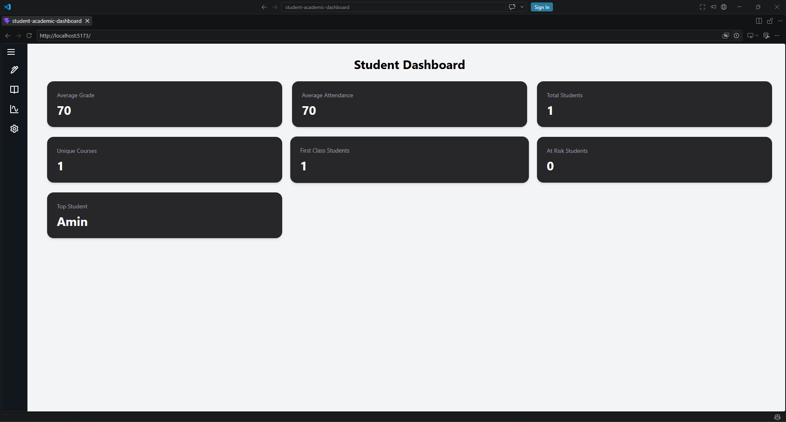
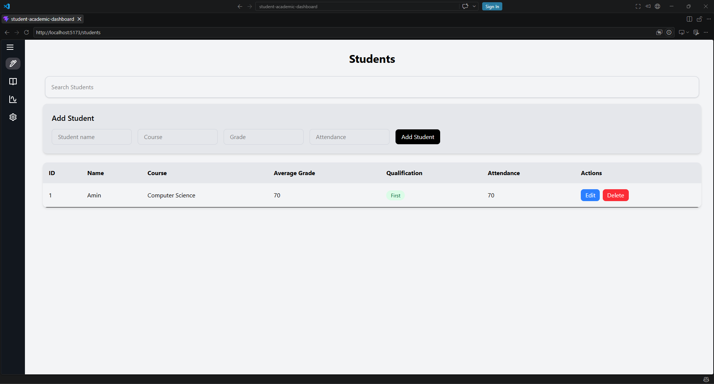

# Student Academic Dashboard 
A full-stack application that allows university teachers to categorise and display student academic information alongside admin functionality such as adding, editing and deleting student records.

## Tech Stack

- **React** - Used to create an interactive UI that updates when application state changes.
- **TypeScript** - Used to add types that clearly defined the structure of application data.
- **SQLite** - Database application used to store student information persistently.
- **Node.js** - Runtime that allows my backend JavaScript to execute outside the browser.
- **Tailwind CSS** - Used to handle visual styling. 
- **Express.js** - Used to handle API requests between the frontend and the database and return appropriate responses.

## Features 

- View all student records and academic information.
- Add new student records.
- Edit existing student information.
- Delete student records.
- Search for students.
- Filter students by qualification.
- Confirmation prompts before deleting records.
- Toast notifications for user actions.
- Loading states while student data is being retrieved.
- Error handling for failed API requests. 

## How it works

When the application first loads, the students state is initially empty. After the StudentProvider mounts, useEffect runs and calls a function that loads the student data.

The student service sends a GET request to the Express backend. Express handles the request and queries the SQLite database using SQL. SQLite returns the student records to Express, which sends the data back as JSON.

The student service returns this data to the StudentContext, where setStudents stores it in the students state. Updating the state causes React to re-render, displaying the student information on screen.

## Project Structure 
- `backend/` - Contains the Express server and SQLite database logic. It receives HTTP requests from the frontend, runs the appropriate SQL queries, and sends the results back to the frontend as JSON. 
- `components/` - Contains reusable UI elements used throughout the application. Separating components from pages keeps page files smaller, makes debugging and maintenance easier, promotes reuse and helps keep the interface consistent. 
- `context/` – Contains shared React state for student data. `StudentContext` loads and manages student information so multiple components and pages can access the same data without passing props through every level.
- `pages/` – Contains the main route-level screens of the application, such as Dashboard, Students, Analytics and Settings.
- `services/` – Contains the frontend API communication logic. `studentService.ts` sends HTTP requests to the Express backend and returns the responses to the React application.

## Setup / Running Locally

1. Clone the repository and navigate into the project folder.

2. Install the frontend dependencies:

```bash
npm install
```

3. Start the React frontend:

```bash
npm run dev
```

4. Open a second terminal and navigate to the backend:

```bash
cd backend
```

5. Install the backend dependencies:

```bash
npm install
```

6. Start the Express backend:

```bash
npm run dev
```

7. Open the local Vite URL shown in the terminal in your browser.

## Screenshots 

### Dashboard



### Students



## Future Improvements

- Deploy the frontend and backend so the application can be accessed online.
- Improve responsive behaviour for smaller screens and mobile devices.
- Expand the Analytics page with more detailed charts and student performance insights.
- Add authentication and user accounts so access to student data can be controlled.
